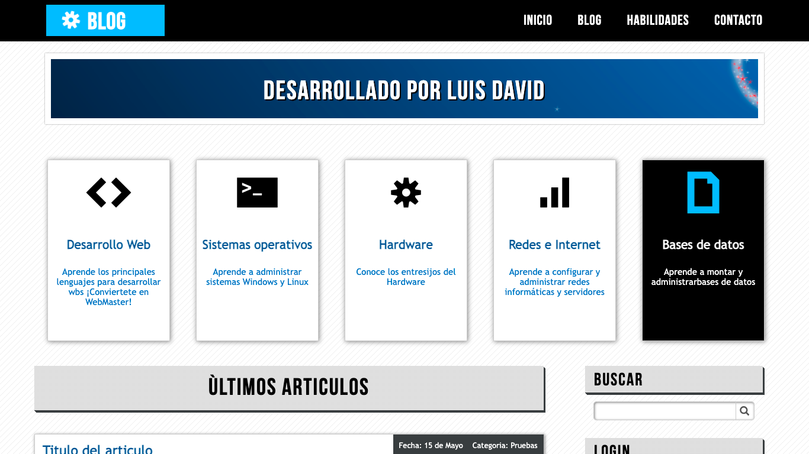

# Animated Blog

## Table of contents

- [Overview](#overview)
  - [The challenge](#the-challenge)
  - [Screenshot](#screenshot)
- [My process](#my-process)
  - [Built with](#built-with)
  - [What I learned](#what-i-learned)
  - [Continued development](#continued-development)
- [Author](#author)

## Overview

### The challenge

Users should be able to:

- View the page from any device
- View real-time and functional animations
- See a section of sample articles
- See navigation menus that do not contain links
- View an integrated Google map

### Screenshot

## My process

### Built with

- HTML
- CSS
- CSS animations
- CSS tranistions

### What I learned

In this project I learned how to make a completely front end blog template, without back end functionalities, but using different animations and keyframes to give better visual access and internalize a completely google map using iframes to load the map.

### Continued development

Add actions or pages to each of the links in the navbar so that it works like a real blog and can include an api to see information in real time.

## Author

Luis David Jimenez Martinez
- Portfolio - [www.luisdavidjm.com](https://www.luisdavidjm.com)
- GitHub - [LuisDavidJM](https://github.com/LuisDavidJM)
